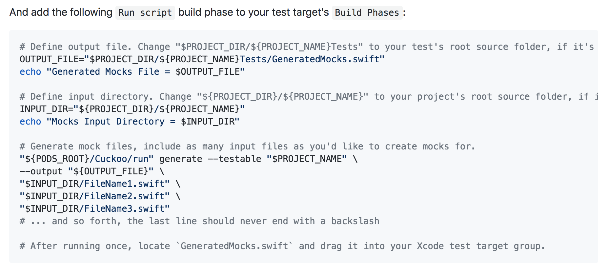

footer: iPhone Dev Sapporo勉強会 Jul, 2018

## コード生成のススメ

---

# Takeshi Ihara

- Twitter: @nonchalant0303
- GitHub: Nonchalant


---

## コード生成

- SwiftではRuntime Reflectionがあまり強力ではない
    - プログラムの実行過程でプログラム自身の構造を読み取ったり書き換えたりする技術
- その代わりSwiftではコード生成で解決することが増えてきた
    - ex. ボイラープレートの自動生成

---

## DIKit

#### https://github.com/ishkawa/DIKit

DIKit provides interfaces to express dependency graph. 
A code generator named dikitgen finds implementations of the interfaces, and **generate codes** which satisfies dependency graph.

---

## Cuckoo

#### https://github.com/Brightify/Cuckoo

Cuckoo has two parts. One is the runtime and the other one is an OS X command-line tool simply called CuckooGenerator.

Unfortunately Swift does not have a proper reflection, so we decided to use **a compile-time generator** to go through files you specify and generate supporting structs/classes that will be used by the runtime in your test target.

---

## DIKit

#### https://github.com/ishkawa/DIKit


---

## Cuckoo

#### https://github.com/Brightify/Cuckoo



---

## Sourcery

#### https://github.com/krzysztofzablocki/Sourcery

Sourcery is **a code generator** for Swift language, built on top of Apple's own SourceKit. It extends the language abstractions to allow you to generate boilerplate code automatically.

---

## Sourcery

```swift
protocol Animal {
    func bark()
}

struct Dog: Animal {} // コンパイルエラー

struct Apple {}
```

---

## Stencil

#### ファイルテンプレート言語

```

extension {{ struct.name }} {
    func bark() {
        print("{{ struct.name }}")
    }
}

```

↓ Sourcery

```swift
extension Cat {
    func bark() {
        print("Cat")
    }
}
```

---

## SourceKitten

#### https://github.com/jpsim/SourceKitten

- An adorable little framework and command line tool for interacting with SourceKit
- DIKit, Cuckoo, Sourceryで採用されている

---

## SourceKitten

#### 使ってみる

```swift
// Source.swift
struct Dog {}
```

```swift
// SourceKitten
import SourceKittenFramework

let file = File(path: "./Source.swift")!
let dic = try! Structure(file: file).dictionary
print(dic)
```

---

## SourceKitten

#### `[String: SourceKitRepresentable]`

```swift
struct Dog {}
```

```
[
    "key.diagnostic_stage": "source.diagnostic.stage.swift.parse", 
    "key.substructure": [
        [
            "key.bodylength": 0, 
            "key.nameoffset": 7,
             "key.accessibility": "source.lang.swift.accessibility.internal", 
             "key.length": 13, 
             "key.name": "Dog", 
             "key.kind": "source.lang.swift.decl.struct", 
             "key.namelength": 3, 
             "key.offset": 0, 
             "key.bodyoffset": 12
        ]
    ], 
    "key.offset": 0, 
    "key.length": 13
]
```

---

## FactoryProvider

#### https://github.com/Nonchalant/FactoryProvider

- SourceKitten + Stencilを使ってファクトリーを自動生成するライブラリを作ってみた！
- 詳細はどこかに資料あげます！ (iOSDC落ちてしまった...)

---

## Demo

---

## まとめ

- コード生成楽しい！がやりすぎると属人化するのでシンプルに扱うのが大事な気がした
- iOSDC or DevSapでまた会いましょう！


