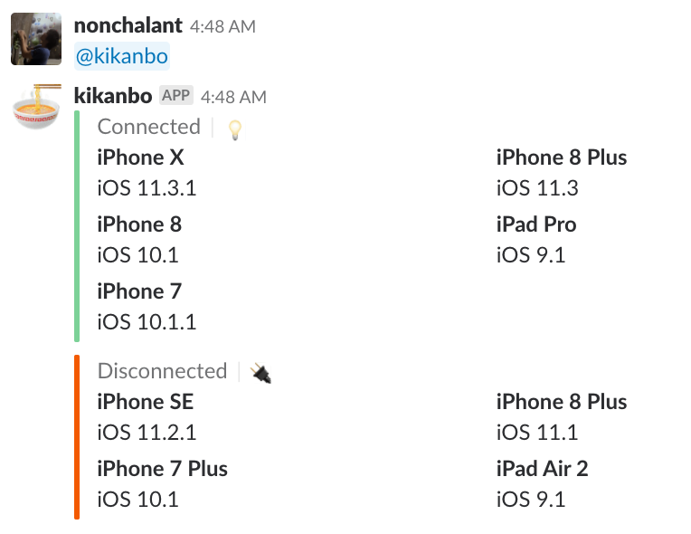

footer: iOSDC Japan 2018 LT

### 小さくはじめる端末管理

---

# Takeshi Ihara

- AbemaTV
- Twitter: @nonchalant0303
- GitHub: Nonchalant

---

## 検証に使う端末

- OSバージョンが上がっている
- 借りようとする端末がない

---

## MDM (Mobile Device Management)

#### 複数の端末を一元的に管理するための仕組み

- 端末紛失時のリモート制御 (ロック、データ削除など)
- セキュリティポリシーやアプリケーションの配布、管理
- アプリケーションや機能の利用制限と監視
  - OSアップデートの制限

---

## MDM (Mobile Device Management)

#### 複数の端末を一元的に管理するための仕組み

- コストが高い
    - 例: 50,000円 + 3,600円 * デバイス数 (CLOMO)
- 管理したいデバイス数がそんなに多くない

---

## チケット管理

- 端末毎にJIRA上でチケットを作成
- 借りるときにチケットのステータスを変更

---

## チケット管理

### 未実施

- ステータスを変更しない人が多そう
- OSバージョンが上がってしまう問題は未解決

---

## ロック + 社員証で認証する

- 端末の充電口にロックをかける
- 社員証で特定の端末のロックが解放される

---

## ロック + 社員証で認証する

- セットアップがめんどくさい
    - 思いついたがどうやって進めていいかわからない
- OSバージョンが上がってしまう問題は未解決

---

## SlackBot + MacMiniで管理する

- 各端末の名前, OS, Device情報, 接続情報が表示される
- このBotを使っても使わなくても問題ない

---

## SlackBot + MacMiniで管理する

- Jenkins + Deploy用のMacMiniが余ってた
- 実機でUITestするためにMacMiniに端末が繋がっていた
    - 電話とチャットのテスト

---

## SlackBot + MacMiniで管理する

- 誰が借りたかわからない
    - そんなに問題じゃなかった -> Slackで聞けばいい
- OSバージョンが常に最新の情報で得られる
    - 勝手に上がることじゃなくて乖離が問題だった

---

# OSS

### https://github.com/Nonchalant/kikanbo

GoのCLIツールとして公開しています

---

## まとめ

- 問題点が何か様々な解決策を検討することで認識できた
    - ツール作りが楽しくてオーバーエンジニアリングしがち
- GoでCLIツール作るの楽しい
    - Cobraというテンプレート生成ツールが便利だった
    - Docker, Kubernetesも使っている