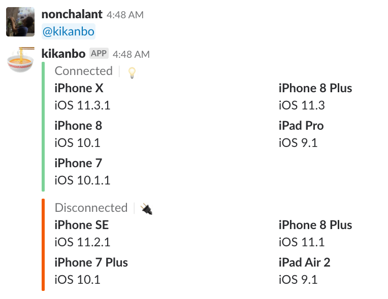

footer: iOSDC Japan 2018 LT

##### 小さくはじめる端末管理

2018/09/02
iOSDC Japan 2018 LT
Takeshi Ihara @nonchalant0303

^ 小さくはじめる端末管理というタイトルでLTをさせていただきます。
今回の話はかなり環境に依存する話になるので、参考になる方が少ないかもしれませんがお飲み物を飲みながら小話程度に聞いていただけたらと思います。
それでは、よろしくお願いします。

---

## 検証に使う端末 (iOS)

- OSバージョンが上がっている
- 借りようとする端末がない

^ 端末管理というワードがタイトルに入っていますが、具体的にはモバイルアプリの挙動のチェックに使うiOS端末をメインに話していきます。
開発しているアプリを様々なOSや解像度で正常に動いていることを確認するために個人や会社で複数の端末を所有していると思います。
端末を借りようとする際に借りようと思っていた端末のOSバージョンが上がっていたり、そもそも借りようとしている端末が貸出中だったということはありませんでしょうか？
この課題を解決するためにいくつかの方法を考えました。

---

## MDM (Mobile Device Management)

#### 複数の端末を一元的に管理するための仕組み

- 端末紛失時のリモート制御 (ロック、データ削除など)
- セキュリティポリシーやアプリケーションの配布、管理
- アプリケーションや機能の利用制限と監視
  - OSアップデートの制限

^ 複数の端末を一元的に管理するための仕組みとしてMDMというものがあります。
これを用いることでOSのアップデートを制限することができ、端末情報なども遠隔で分かります。

---

## MDM (Mobile Device Management)

#### 複数の端末を一元的に管理するための仕組み

- 管理したいデバイス数がそんなに多くない
- コストが高い
    - セットアップのコスト
    - 例: 19,800円 + 3,600円 * デバイス数

^ しかし、基本的な挙動チェックはQAチームに依頼するため、開発側で管理したいデバイスはそこまで数が多くなく、MDMだとセットアップのコストが高く感じたため一旦見送ることにしました。

---

## チケット管理

- 端末毎にJIRA上でチケットを作成
- 借りるときにチケットのステータスを変更

^ 次はもっと簡易的な仕組みで管理する方法を考えました。
まず、JIRAなどのサービスを用いて、各デバイスに対応するチケットを用意します。
そのチケットにOSバージョンや端末情報を記載して、借りるときにチケットを貸出中ステータスに変えて可視化するというものです。

---

## チケット管理

### 未実施

- ステータスを変更しない人が多そう
- OSバージョンが上がってしまう問題は未解決

^ 結論から言うとこの方法も採用しませんでした。
マニュアルに依存する部分が多いので、健全に運営するのが厳しいだろうと考えたためです。

---

## SlackBot + MacMiniで管理する

- 各端末の名前, OS, Device情報, 接続情報が表示される

^ 最終的にはSlackBot + MacMiniを用いて管理する方法を採用しました。
これはBotに問い合わせると各端末の名前, OS, Device情報, 接続情報が表示されるというものです。
Connectedが現在MacMiniにつながっている、つまり貸出可能な端末です。
Disconnectedが現在MacMiniにつながっていないので、貸出中の端末です。

---

## SlackBot + MacMiniで管理する

- Jenkins + Deploy用のMacMiniが余ってた
- 実機でUITestするためにMacMiniに端末が繋がっていた
    - 電話とチャットのテスト

^ なぜこの方法にしたかというと、社内に実機でUITestするためのMacMiniがあったので、それを活用させてもらいました。

---

## SlackBot + MacMiniで管理する

- 誰が借りたかわからない
    - そんなに問題じゃなかった -> Slackで聞けばいい
- OSバージョンが常に最新の情報で得られる
    - 勝手に上がることじゃなくて乖離が問題だった
- このBotを使っても使わなくても問題ない

^ いろいろと端末管理の方法を考えていくうちにいくつかのことに気づきました。
最初は誰が借りたかという情報も管理するつもりだったのですが、シンプルに貸出されているかどうかだけ知りたいなということに気づきました。
また、OSバージョンが勝手に上がってしまう問題ですが、これは勝手に上がることが問題じゃなくて、管理している情報との乖離が問題だと気づきました。
この問題は制作したBotはリアルタイムに端末情報をとってくるので発生しなくなっています。
そして、検証端末を借りる人に新しい管理方法を強制せずに、またこのBotを使っても使わなくても問題ではないという点が最大の魅力です。

---

# OSS

### https://github.com/Nonchalant/kikanbo

GoのCLIツールとして公開しています

^ 今回紹介したBotはGoのCLIツールとして公開しています。
内部実装としてはinstrumentsコマンドを用いて端末の情報を取得しています。
一度接続された端末はローカルのファイルに端末情報を記録しているので、接続されていない端末も表示できています。
また、自動で記録されるので最初に端末情報をまとめたりする必要がありません。
接続してBotを動かすだけで動作します。

---

## まとめ

- 問題点が何か様々な解決策を検討することで認識できた
    - ツール作りが楽しくてオーバーエンジニアリングしがち
- GoでCLIツール作るの楽しい
    - Cobraというテンプレート生成ツールが便利だった
    - Docker, Kubernetesも使っている
- 時間があればMicroMDMなども試してみたい！

^ 様々な解決策を検討することで、実際の問題点を認識できて解決策を小さくはじめれたかなと思っています。
いつも技術を使って解決するのが楽しくてついオーバーエンジニアリングしてしまうのですが、今回はかなりスコープを区切って実現できたかなと思っています。
ただ、それぞれの環境にあった管理方法があると思うので、問題点を洗い出すところから始めてもよいかもしれません。
この会場の人だと、SwiftPMでのCLIツールづくりがメジャーだと思いますが、GoでCLIツールを作るのも楽しかったので、もしSwiftPMに飽きたらこちらも手を出してみるのも楽しいかと思います。
もう少し時間があればMicroMDMなどの無料のMDMサービスも試してみようかと思います。

---

# Takeshi Ihara

- AbemaTV (2018/09/01 ~)
- Twitter: @nonchalant0303
- GitHub: Nonchalant

^ 最後に自己紹介します。
井原岳志と申します。
ちょうど昨日の9/1からAbemaTVにジョインさせていただきました。
この発表がはじめての仕事ということなので少し緊張してました。

---

# ※ 今回は前職の話でした

^ というわけで今回は前職の話です。そこは誤解なきようにお願いします。

---

## 俺コン (09/12 ~ 13)

^ 惜しくもiOSDCで採択されなかったトークの中で、人気の高かったトークを聞ける俺コンというイベントを開催します。
9/12, 13と2日連続で開催されるので、興味がある方はこちらも参加してみてください。

---

## iOSDC 2018 Reject Conference (09/18)

「Factoryの自動生成によりテストを書きやすくする」という
タイトルで発表します。

^ 「Factoryの自動生成によりテストを書きやすくする」というタイトルでリジェクトコンで発表します。
テストの際にオブジェクトをいちいち定義するのが面倒なので、テストオブジェクトを自動生成するという内容で話させていただきます。
