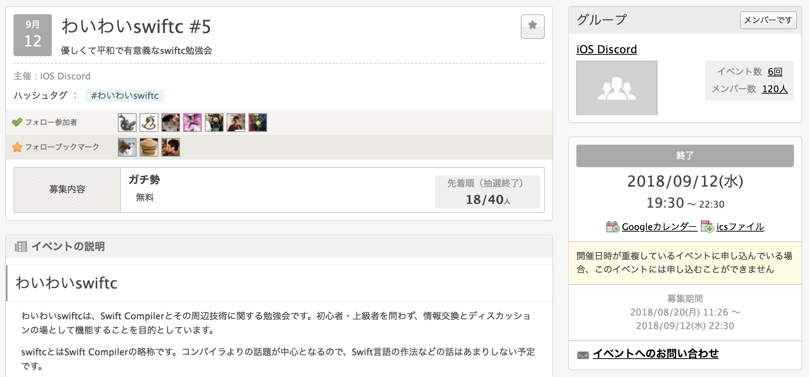

footer: Factoryの自動生成によりテストを書きやすくする, iOSDC 2018 Reject Conference days1
slidenumbers: true

# Factoryの自動生成によりテストを書きやすくする

^ 「Factoryの自動生成によりテストを書きやすくする」というタイトルで発表をさせていただきます。

---

# Takeshi Ihara

- AbemaTV
- Twitter: @nonchalant0303
- GitHub: Nonchalant
- Climbing 🧗‍♀️
- Game 🎮


^　井原岳志と申します。
AbemaTVで働いています。
普段はプログラミングかクライミングかゲームをして過ごしています。
本日はよろしくお願いいたします。

---

### Test

```swift
struct User {
    let age: Int
    
    var isAdult: Bool {
        return age >= 20
    }
}

class UserTests: XCTestCase {
    func test20歳以上なら成人である() {
        let user = User(age: 20)
        XCTAssertTrue(user.isAdult)
    }
    
    func test20歳未満なら成人でない() {
        let user = User(age: 19)
        XCTAssertFalse(user.isAdult)
    }
}
```

^ タイトルにテストというキーワードが入っていますが、まず簡単なテストの例を考えてみましょう。
テスト対象はUser型のisAdultというプロパティです。
テストケースは「20歳以上なら成人である」と「20歳未満なら成人でない」の2つです。
今回はこのコードをベースに発表していこうと思います。

---

### New Property

[.code-highlight: 2]

```swift
struct User {
    let name: String
    let age: Int
    
    var isAdult: Bool {
        return age >= 20
    }
}

class UserTests: XCTestCase {
    func test20歳以上なら成人である() {
        let user = User(age: 20)
        XCTAssertTrue(user.isAdult)
    }
    
    func test20歳未満なら成人でない() {
        let user = User(age: 19)
        XCTAssertFalse(user.isAdult)
    }
}
```

^ 例えばAPIのレスポンスが変更されるなどで、User型に新しいプロパティのnameが増えたケースを考えます。
このようなことはプロダクト開発でよくあると思います。
では、このようなときにテストケースはどうなるか考えてみましょう。

---

### Compile Error

[.code-highlight: 13, 18]

```swift
struct User {
    let name: String
    let age: Int
    let birthday: Date
    
    var isAdult: Bool {
        return age >= 20
    }
}

class UserTests: XCTestCase {
    func test20歳以上なら成人である() {
        let user = User(age: 20) // Missing argument for parameter 'name' in call
        XCTAssertTrue(user.isAdult)
    }
    
    func test20歳未満なら成人でない() {
        let user = User(age: 19) // Missing argument for parameter 'name' in call
        XCTAssertFalse(user.isAdult)
    }
}
```

^ User型のinitializerのコードがnameプロパティを渡していないので、コンパイルエラーになってしまいます。

---

### Fragile Test

[.code-highlight: 12, 17]

```swift
struct User {
    let name: String
    let age: Int
    
    var isAdult: Bool {
        return age >= 20
    }
}

class UserTests: XCTestCase {
    func test20歳以上なら成人である() {
        let user = User(name: "Takeshi Ihara", age: 20)
        XCTAssertTrue(user.isAdult)
    }
    
    func test20歳未満なら成人でない() {
        let user = User(name: "Takeshi Ihara", age: 19)
        XCTAssertFalse(user.isAdult)
    }
}
```

^ このエラーはinitializerにnameプロパティをセットしてあげれば解決できます。
しかし、これはUser型に変更があるたびにテストコードも変更しないといけないので、いわゆる「脆いテスト」と呼ばれる状態になってしまっています。
このような「脆いテスト」が大量にあると、メンテナンスのコストが無視できないほど高くなってしまいます。

---

### Factory Pattern

オブジェクトの生成処理を共通化する

[.code-highlight: 1-5, 9, 14]

```swift
struct UserFactory {
    static func provide(name: String = "", age: Int = 0) -> User {
        return User(name: name, age: age)
    }
}

class UserTests: XCTestCase {
    func test20歳以上なら成人である() {
        let user = UserFactory.provide(age: 20)
        XCTAssertTrue(user.isAdult)
    }
    
    func test20歳未満なら成人でない() {
        let user = UserFactory.provide(age: 19)
        XCTAssertFalse(user.isAdult)
    }
}
```

^ この状態を回避するための1つとして、タイトルに入っているもうひとつのキーワードのFactory Patternと呼ばれるデザインパターンがあります。
オブジェクトの生成コード、ここでいうUser型のinitializerをFactoryと呼ばれるものにまとめます。
これにより、各テストケースからは具体的なオブジェクトの生成コードを隠蔽することができます。
User型になにかしらの変更があったときはFactoryのコードを修正すればいいので、メンテナンスのコストを削減することができます。

---

### Cost of Factory

- テスト対象のオブジェクトの数だけFactoryが必要になる
    - ネストが深い型だと依存オブジェクトの数だけ必要になる
- Factoryなどを用意するコストが高いとテストを書かなくなる

^ Factory Patternの紹介の発表でしたらここで終わりなのですが、今回はもう一歩踏み込んで、Factoryのコストについて考えていきましょう。
まず、「脆いテスト」を回避するためにテスト対象のオブジェクトの数だけFactoryが必要になります。
ネストが深い型だと一度に大量のオブジェクトのFactoryが必要になってしまいます。
また、Factoryを用意するコストが高いと、つい「脆いテスト」を書いてしまったり、テスト自体を書かなくなってしまいます。

^ 3min

---

## FactoryProvider

<sup>https://github.com/Nonchalant/FactoryProvider</sup>


^ この問題を解決するために、FactoryProviderというライブラリを作りました。
こちらのライブラリはGitHubで公開しています。

---

## FactoryProvider

<sup>https://github.com/Nonchalant/FactoryProvider</sup>

- Factoryを自動生成するライブラリ
- Enum, Structが生成対象
- Lensをサポート
- ymlで設定項目を定義
- Generatorを含めるためにCocoapodsでのみインストール可能

^ FactoryProviderはFactoryを自動生成するライブラリです。
Enum, Structが自動生成の対象になっています。
Lensをサポートしているので、オブジェクトの変更も容易です。
Lensについては後に詳しく説明します。
SwiftLintやSourceryなどと同様に、ymlで設定項目を定義できます。
これはデメリットなのですが、自動生成するためのGeneratorをライブラリに含めるためにCocoapodsでしかサポートしていません。

---

### Factory (Struct)

型パラメータにStructを指定する

```swift
import FactoryProvider

let user = Factory<User>.provide()
// User(name: "", age: 0)
```

^ FactoryProviderは型パラメータをひとつ取るFactoryという名前のStructを提供します。
Factoryの型パラメータにStructのUserを渡して、provideメソッドを呼ぶとUserオブジェクトが返ってきます。

---

### Factory (Enum)

型パラメータにEnumを指定する

```swift
import FactoryProvider

let season = Factory<Season>.provide()
// Season.spring

enum Season {
    case spring
    case summer
    case automn
    case winter
}
```

^ Enumの場合も同様です。
Factoryの型パラメータにEnumのSeasonを渡して、provideメソッドを呼ぶとSeason.springが返ってきます。
このような感じでFactoryProviderを用いてオブジェクトを取得できます。

---

### Generated Object

固定値で生成される😱

[.code-highlight: 3-4, 7]

```swift
import FactoryProvider

var user = Factory<User>.provide()
user.name = "Takeshi Ihara" // Cannot assign to property: 'name' is a 'let' constant

struct User {
    let name: String
    let age: Int
    
    var isAdult: Bool {
        return age >= 20
    }
}
```

^ オブジェクトは固定値で生成されます。
ですので、プロダクションコード側でプロパティがlet修飾子で宣言されていると、テストコード上でプロパティを変更できないです。
回避策の1つとしては各プロパティをvar修飾子で宣言するという方法がありますが、テストコードのためにプロダクションコードを変更するのはあまり良い手とは言えません。

---

### Lens

- 不変性を保ちつつネストしたデータ構造に対するアクセスをLensの合成で表現できるようにしたもの
- 元々はHaskellの概念
- SwiftzのLens実装を独立したフレームワークとして切り出したFocusというフレームワークも存在
    - https://github.com/typelift/Focus

^ この問題を解決するためにLensを用います。
定義としては「不変性を保ちつつネストしたデータ構造に対するアクセスを関数の合成で表現できるようにしたもの」です。
元々はHaskell界隈から登場した概念ですが、SwiftでもSwiftzと呼ばれるフレームワークに含まれています。
また、さらにSwiftzからLens実装を独立したフレームワークとして切り出したFocusというものも存在します。
興味がある方はこちらも見てみると面白いかと思います。

---

### Lens

```swift
import FactoryProvider

let user = Factory<User>.provide()
// User(name: "", age: 0)

let newUser = user |> User._age *~ 20 // User._ageをLensと呼ぶ
// User(name: "", age: 20)
```

^ FactoryProviderにおけるLensの使い方について説明します。
provideメソッドで生成した固定値のオブジェクトのuserにUser._ageを適用してageプロパティの値が差し替えられた新しいオブジェクトを取得できます。
User._ageはLensと呼ばれる構造になっています。

---

### Lens (Nested)

[.code-highlight: 4, 9-11, 13-14]

```swift
import FactoryProvider

struct User {
    let id: UserId
    let name: String
    let age: Int
}

struct UserId {
    let value: String
}

let user = Factory<User>.provide() |> User._id * UserId._value *~ "nonchalant0303"
// User(id: UserId(value: "nonchalant0303"), name: "", age: 0)
```

^ ネストした型もサポートしています。
User型の新しいプロパティのUserId型のidについて考えます。
UserId型はプロパティにString型のvalueを持っています。
このネストされているidのvalueを差し替えるケースを考えていきます。
先程の例と同様に、Lensと呼ばれるUser._idを用いるのですが、もうひとつUserId._valueを用います。
この2つのLensを合成してidのvalueにアクセスすることが可能になります。
これによりidのvalueが差し替えられたUserオブジェクトを取得できます。
どうやってこの挙動を実現しているかは後ほど説明します。

---

### Config

ymlファイルで設定する

```yml
includes: # 生成対象のStruct, Enumを含んだファイルへのパス (ファイル単位、ディレクトリ単位)
  - Input/SubInput1
  - Input/SubInput2/Source.swift
excludes: # 生成対象のStruct, Enumの例外を含んだファイルへのパス
  - Input/SubInput1/SubSubInput
  - Input/SubInput2/Source.swift
testables: # テスト対象のターゲット
  - target1
  - target2
output: output/Factories.generated.swift # 自動生成されたコードのパス
```

^ 設定項目はymlファイルで定義できます。
includesで生成対象のファイルを、excludesで生成対象の中から除外対象を設定できます。
また、testablesでテスト対象のターゲットを設定します。
自動生成されたコードはoutputで設定されたパスに保存されます。

---

### Build Phases

テストの実行時にFactoryの自動生成スクリプトを呼び出す

```bash
"${PODS_ROOT}/FactoryProvider/generate" --config .factory.yml
# Factories.generated.swift is generated 🎉
```

^ 生成対象のオブジェクトは開発中に変更されることが考えられるので、XcodeのBuild Phasesに自動生成スクリプトを含めておくのを推奨します。
これにより、FactoryProviderがFactoryを自動生成します。
Build Phasesに記述しておくと、オブジェクトが変更されても変更に追従してFactoryが自動生成し直されます。
このようにFactoryProviderはFactoryを用意するコストを削減できます。

^ 8min

---

## How FactoryProvider Works

2つのコードベースから成り立つ

- FactoryProviderのコード (Fixed)
- 自動生成されるコード (Generated in Build Phases)

^ これまではFactoryProviderの使い方について説明してきました。
これからはFactoryProviderがどうやって動いているかについて説明します。
FactoryProviderは2つのコードベースから成り立っています。
1つはFactoryProviderフレームワークのコードです。これは定義済みのコードなので不変なものです。
もう片方は自動生成されるコードです。
これはプロダクションコードに依存するので、Build Phasesなどで生成される可変なコードです。

---

### Providable (FactoryProvider)

Providableに準拠した型がFactoryでオブジェクトを取得できる

```swift
public protocol Providable {
    static func provide() -> Self
}
```

^ FactoryProviderはProvidableプロトコルを提供します。
このプロトコルは自身の型を返すスタティックメソッドのprovideを宣言しています。

---

### Primitive Factory (FactoryProvider)

Primitiveな型のFactoryが定義されている (Int, Optional, String, ...)

```swift
extension Int: Providable {
    public static func provide() -> Int {
        return 0
    }
}

extension Optional: Providable where Wrapped: Providable {
    public static func provide() -> Optional {
        return .some(Wrapped.provide())
    }
}

...
```

^ また、FactoryProviderではPrimitiveな型、IntやOptionalなどのFactoryが定義されています。
extensionでPrimitiveな型をProvidableプロトコルに準拠させて、provideメソッドをimplementしています。
Optionalなどの型パラメータを持つ型はConditional Conformanceを用いて、WrappedがProvidableに準拠していたら、OptionalもProvidableプロコトルに準拠するようにextensionで定義しています。

---

### Factory (FactoryProvider)

```swift
struct Factory<T: Providable> {
    static func provide() -> T {
        return T.provide()
    }
}
```

^ 型パラメータにProvidableプロコトルに準拠しているTをとるFactoryを提供しています。
User.provideみたいに直接生成メソッドを呼べるので、このstruct自体はあまり意味がないのですが、コードを読むときにFactoryでオブジェクトが生成されていることを分かりやすくするためにインターフェイスとして提供しています。

---

### Specified Factory (Generated Code)

```swift
import FactoryProvider

extension User: Providable {
    static func provide() -> User {
        return User(
            id: Factory<UserId>.provide(),
            name: Factory<String>.provide(),
            age: Factory<Int>.provide()
        )
    }
}

extension UserId: Providable {
    static func provide() -> UserId {
        return UserId(
            value: Factory<String>.provide()
        )
    }
}
```

^ 自動生成されるコードでは生成対象のオブジェクトのFactoryが含まれます。
Primitiveな型と同様にextensionでProvidableプロトコルに準拠させています。

---

### Specified Factory (Generated Code)

[.code-highlight: 6-8, 16]

```swift
import FactoryProvider

extension User: Providable {
    static func provide() -> User {
        return User(
            id: Factory<UserId>.provide(),
            name: Factory<String>.provide(),
            age: Factory<Int>.provide()
        )
    }
}

extension UserId: Providable {
    static func provide() -> UserId {
        return UserId(
            value: Factory<String>.provide()
        )
    }
}
```

^ ただ、これらのFactoryはPrimitiveな型のFactoryと少し違います。
プロパティにプロダクションコードで定義された独自型がある場合は再帰的にFactoryが呼び出されて、FactoryProviderで定義されたPrimitiveな型のFactoryが呼ばれるまで再帰的に呼び続けます。

---

### Specified Factory (Generated Code)

葉がすべてPrimitiveな型になるまで木を伸ばす


^ この仕組みは木構造をイメージすれば分かりやすいかと思います。
User型を根ノードして、各プロパティ、id, name, ageの型、つまりUserId, String, Intを子ノードとして定義します。
すべての葉がPrimitiveな型に到達するまで探索を続けて、Factoryの木を構成します。

---

### Lens (FactoryProvider)

```swift
public struct Lens<Whole, Part> {
    private let getter: (Whole) -> Part
    private let setter: (Part, Whole) -> Whole

    public init(getter: @escaping (Whole) -> Part, setter: @escaping (Part, Whole) -> Whole) {
        self.getter = getter
        self.setter = setter
    }

    public func get(_ from: Whole) -> Part {
        return getter(from)
    }

    public func set(_ from: Part, _ to: Whole) -> Whole {
        return setter(from, to)
    }
}
```

^ 次はLensについて説明します。
Lensは2つの型パラメータを取るStructです。
具体例をあげて説明すると、WholeはUser型などで、PartはnameプロパティのString型などが取られます。

---

### Custom Operator (FactoryProvider)

```swift
infix operator *~: MultiplicationPrecedence
infix operator |>: AdditionPrecedence

public func * <A, B, C> (lhs: Lens<A, B>, rhs: Lens<B, C>) -> Lens<A, C> {
    return Lens<A, C>(
        getter: { a in
            rhs.get(lhs.get(a))
        },
        setter: { (c, a) in
            lhs.set(rhs.set(c, lhs.get(a)), a)
        }
    )
}

public func *~ <A, B> (lhs: Lens<A, B>, rhs: B) -> (A) -> A {
    return { a in
        lhs.set(rhs, a)
    }
}

public func |> <A, B> (x: A, f: (A) -> B) -> B {
    return f(x)
}

public func |> <A, B, C> (f: @escaping (A) -> B, g: @escaping (B) -> C) -> (A) -> C {
    return { g(f($0)) }
}
```

^ Lensを扱いやすくするために各種オペレータ用の演算子を定義しています。
1つ1つ説明していきます。

---

### Compose (FactoryProvider)

```swift
public func * <A, B, C> (lhs: Lens<A, B>, rhs: Lens<B, C>) -> Lens<A, C> {
    return Lens<A, C>(
        getter: { a in
            rhs.get(lhs.get(a))
        },
        setter: { (c, a) in
            lhs.set(rhs.set(c, lhs.get(a)), a)
        }
    )
}
```

^ *はLensを合成するための演算子です。
これはCompose関数と呼びます
2つのLensを引数に受け取って合成されたLensを返します。
これを用いることでネストした型のアクセスを実現します。

---

### Set (FactoryProvider)

```swift
infix operator *~: MultiplicationPrecedence

public func *~ <A, B> (lhs: Lens<A, B>, rhs: B) -> (A) -> A {
    return { a in
        lhs.set(rhs, a)
    }
}
```

^ *~は特定のプロパティの値をセットする演算子です。
これはSet関数と呼びます。
Lensと具体的な値を引数に受け取って、Aを受け取ってAを返す関数を返します。
具体的な例を出すと、AはUser型などで、User型を受け取って一部のプロパティの値を差し替えたUser型を返します。

---

### Modify (FactoryProvider)

```swift
infix operator |>: AdditionPrecedence

public func |> <A, B> (x: A, f: (A) -> B) -> B {
    return f(x)
}

public func |> <A, B, C> (f: @escaping (A) -> B, g: @escaping (B) -> C) -> (A) -> C {
    return { g(f($0)) }
}
```

^ |>は関数を適用する演算子です。
これはModify関数と呼びます。
具体的な値と関数を受け取って、その関数に値を適用します。

---

### Lens (Generated Code)

```swift
extension User {
    static var _name: Lens<User, String> {
        return Lens<User, String>(
            getter: { $0.name },
            setter: { name, base in
                User(name: name, age: base.age)
            }
        )
    }
    static var _age: Lens<User, Int> {
        return Lens<User, Int>(
            getter: { $0.age },
            setter: { age, base in
                User(name: base.name, age: age)
            }
        )
    }
}
```

^ 生成対象のコードの各プロパティのLensが自動生成されます。
getterは対象プロパティの値を返すクロージャで、setterは対象プラパティの値を差し替えたオブジェクトを返すクロージャです。

---

### Decompose

```swift
let user = Factory<User>.provide() |> User._name *~ "Takeshi Ihara"
         = (User._name *~ "Takeshi Ihara")(Factory<User>.provide())
         = { user in
               Lens<User, String>(
                   getter: { $0.name },
                   setter: { name, base in
                       User(name: name, age: base.age)
                   }
               ).set("Takeshi Ihara", user)
           }(Factory<User>.provide())
         = { name, base in
                User(name: name, age: base.age)
           }("Takeshi Ihara", Factory<User>.provide())
         = User(name: "Takeshi Ihara", age: 0)
```

^ 具体例にどのようになっているかを説明します。

---

### Decompose

[.code-highlight: 1]

```swift
let user = Factory<User>.provide() |> User._name *~ "Takeshi Ihara"
         = (User._name *~ "Takeshi Ihara")(Factory<User>.provide())
         = { user in
               Lens<User, String>(
                   getter: { $0.name },
                   setter: { name, base in
                       User(name: name, age: base.age)
                   }
               ).set("Takeshi Ihara", user)
           }(Factory<User>.provide())
         = { name, base in
                User(name: name, age: base.age)
           }("Takeshi Ihara", Factory<User>.provide())
         = User(name: "Takeshi Ihara", age: 0)
```

^ FactoryProviderを使ってnameプロパティにTakeshi Iharaという値がセットされたUser型を返す式が1行目になります。
では、ひとつひとつ分解していきましょう。

---

### Decompose (|>)

[.code-highlight: 1-2]

```swift
let user = Factory<User>.provide() |> User._name *~ "Takeshi Ihara"
         = (User._name *~ "Takeshi Ihara")(Factory<User>.provide())
         = { user in
               Lens<User, String>(
                   getter: { $0.name },
                   setter: { name, base in
                       User(name: name, age: base.age)
                   }
               ).set("Takeshi Ihara", user)
           }(Factory<User>.provide())
         = { name, base in
                User(name: name, age: base.age)
           }("Takeshi Ihara", Factory<User>.provide())
         = User(name: "Takeshi Ihara", age: 0)
```

^ まずModify演算子を分解します。
Modify演算子は関数に値を適用する演算子なので、(User._name *~ "Takeshi Ihara")クロージャに、Factoryで生成されたUserオブジェクトを渡しています。

---

### Decompose (Lens, *~)

[.code-highlight: 1-10]

```swift
let user = Factory<User>.provide() |> User._name *~ "Takeshi Ihara"
         = (User._name *~ "Takeshi Ihara")(Factory<User>.provide())
         = { user in
               Lens<User, String>(
                   getter: { $0.name },
                   setter: { name, base in
                       User(name: name, age: base.age)
                   }
               ).set("Takeshi Ihara", user)
           }(Factory<User>.provide())
         = { name, base in
                User(name: name, age: base.age)
           }("Takeshi Ihara", Factory<User>.provide())
         = User(name: "Takeshi Ihara", age: 0)
```

^ Lensとset関数を分解して、クロージャの中身を見ていきます。
User._nameはUserとStringを型パラメータに取るLensです。
set関数を分解すると、そのLensのsetメソッドを呼んでいることが分かります。

---

### Decompose (Closure)

[.code-highlight: 1-13]

```swift
let user = Factory<User>.provide() |> User._name *~ "Takeshi Ihara"
         = (User._name *~ "Takeshi Ihara")(Factory<User>.provide())
         = { user in
               Lens<User, String>(
                   getter: { $0.name },
                   setter: { name, base in
                       User(name: name, age: base.age)
                   }
               ).set("Takeshi Ihara", user)
           }(Factory<User>.provide())
         = { name, base in
                User(name: name, age: base.age)
           }("Takeshi Ihara", Factory<User>.provide())
         = User(name: "Takeshi Ihara", age: 0)
```

^ set関数はLensのsetterを呼ぶので、さらにクロージャに分解します。
また、userにFactoryで生成された具体的な値をいれます。

---

### Decompose

[.code-highlight: 1-14]

```swift
let user = Factory<User>.provide() |> User._name *~ "Takeshi Ihara"
         = (User._name *~ "Takeshi Ihara")(Factory<User>.provide())
         = { user in
               Lens<User, String>(
                   getter: { $0.name },
                   setter: { name, base in
                       User(name: name, age: base.age)
                   }
               ).set("Takeshi Ihara", user)
           }(Factory<User>.provide())
         = { name, base in
                User(name: name, age: base.age)
           }("Takeshi Ihara", Factory<User>.provide())
         = User(name: "Takeshi Ihara", age: 0)
```

^ 2つの引数を取るクロージャを実行して、nameプロパティにTakeshi IharaがセットされているUserオブジェクトを取得できます。

---

## Result

[.code-highlight: 10, 14, 19]

```swift
struct User {
    let name: String
    let age: Int
    
    var isAdult: Bool {
        return age >= 20
    }
}

import FactoryProvider

class UserTests: XCTestCase {
    func test20歳以上なら成人である() {
        let user = Factory<User>.provide() |> User._age *~ 20
        XCTAssertTrue(user.isAdult)
    }
    
    func test20歳未満なら成人でない() {
        let user = Factory<User>.provide() |> User._age *~ 19
        XCTAssertFalse(user.isAdult)
    }
}
```

^ では最初に出したテストケースにFactoryProviderを適用するとどうなるか見ていきましょう。
Userオブジェクトを生成するコードにFactoryを用いて、「脆いテスト」から「構造変化に強いテスト」が実現できています。
また、用いてるFactoryは自動生成されるものなので、User型が変更されても手動で修正する必要はないです。

^ 16min

---

# Demo

^ 20min

---

## Future Work (Protocol)

Not support protocol😭

```swift
protocol A {}

// Type 'A' does not conform to protocol 'Providable'
let a = Factory<A>.provide() 
```

^ 現在、Factoryの生成対象はEnum, Structのみなので、Future WorkとしてProtocolをサポートする予定です。
ただ、SwiftのProtocolは一筋縄ではいかないです。

---

## Future Work (Protocol)

Extension of protocol cannot have an inheritance clause😱

```swift
// Extension of protocol 'A' cannot have an inheritance clause
extension A: Providable {
    public static func provide() -> Self {
        fatalError()
    }
}

let a = Factory<A>.provide() 
```

^ まず、EnumやStructと同様にextensionでProvidableプロトコルに準拠させようとします。
しかし、プロコトルのExtensionはinheritance clause、継承を持つことができません。

---

## Future Work (Protocol)

Need concrete type🤔

```swift
protocol A: Providable {}

extension A {
    static func provide() -> Self {
        fatalError()
    }
}

// Using 'A' as a concrete type conforming to protocol 'Providable' is not supported
let a = Factory<A>.provide() 
```

^ では、protocolを宣言時にProvidableプロトコルに準拠させて、extensionでprovideメソッドをimplementしてみましょう。
しかし、これはFactoryの呼び出しでエラーになってしまいます。
AをProvidableプロトコルに準拠しているconcrete type、具体型として扱うのをサポートしていないというエラーです。

---

## Future Work (Protocol)

No problem using concrete type💚

```swift
protocol A: Providable {}

extension A {
    static func provide() -> Self {
        fatalError()
    }
}

struct B: A {}

let a = Factory<B>.provide() 
```

^ では具体型を試してみましょう。
Aに準拠したStructのBを用意します。
これは問題なく動作します。
このようにSwiftのProtocolはEnum, Structと同様に扱うことができないので一筋縄でいかないのです。

---

## わいわいswiftc

興味を持った方はぜひ



^ もし今の話に興味を持った方がいれば、ぜひわいわいswiftcに参加してみると楽しめると思います。
次回はいつ開催されるかは未定ですが、たぶんそのうち開催されると思います。

^ 22min

---

## Future Work (interface)

`User.provide()`のように直接生成メソッドが呼べてしまう😱

```swift
extension User: Providable {
    static func provide() -> Self {
        return User(
            ...
        )
    }
}

let user = User.provide() or Factory<User>.provide()
```

^ 次はFactoryのinterfaceの問題です。
Providableプロコトルに準拠している型をパラメータに取るFactoryを用意していますが、実はprovideメソッドはextensionで宣言しているのでそのまま呼べてしまいます。
直接呼んでも問題はないのですが、テストオブジェクトを生成していることがコードから分かりづらくなってしまう問題があります。

---

## Future Work (interface)

`fileprivate`なGenericsを持つならそのStruct自身も`fileprivate`にしなくてはならない😱

```swift
fileprivate Protocol {
    static func provide() -> Self
}

fileprivate extension User: Providable {
    ...
}

// Generic struct must be declared private or fileprivate because its generic parameter uses a fileprivate type
struct Factory<T: Providable> {
    static func provide() -> T {
        return T.provide()
    }
}
```

^ それを解決するためにfileprivate修飾子を考えてみました。
Factoryはinternalで提供して、各生成メソッドはfileprivateで外部ファイルから呼べなくします。
しかし、これは型パラメータがfileprivateプロコトルに準拠しているのでFactory自体もfileprivateにしなさいというエラーが出てしまいます。
これでは外部ファイルからFactoryを呼べないので意味がなくなってしまいます。

---

## Future Work (interface)

`Factory`にすべて記述する🤔

```swift
struct Factory<T> {
    static func provide() -> T {
        switch T.self {
            case is User.Type:
                return User(
                    name: Factory<String>.provide(),
                    age: Factory<Int>.provide()
                )
            case is String.Type:
                return ""
            ...
            default:
                fatalError()
        }
    }
}
```

^ Providableプロコトルをやめて、Factoryにすべて記述するという方法も考えました。

---

## Future Work (interface)

`Inner Type`をサポートが困難😱 (パースが大変)

```swift
struct User {
    let id: Id
    struct Id {}
}

struct Factory<T> {
    static func provide() -> T {
        switch T.self {
            case is User.Type:
                return User(
                    id: Factory<Id>.provide() // Use of undeclared type 'Id'
                )
            ...
        }
    }
}
```

^ しかし、これだとInner Typeのサポートが困難になってしまうという問題に直面しました。
Inner Typeだと親クラスを省略可能なので、パースから型を特定するのが困難になってしまいます。
extensionだとこの問題は解決できます。
正直、interfaceに関してはアイディアが思いつかないので良いアイディアがある方はアドバイスをいただけると嬉しいです。

---

## FactoryProvider

<sup>https://github.com/Nonchalant/FactoryProvider</sup>


^ まだいろいろと課題はありますが、これからもより使いやすくするためにメンテナンスをしていこうと思います。
ご意見やご要望がございましたら、IssueやPRをお願いします。

---

## Conclusion

- 「構造変化に強いテスト」が実現できた💚
- Factoryを用意する手間がなくなったのでテストに集中できる😍
- テスト対象のプロパティが分かりやすくなった✨
    - `Factory<User>.provide() |> User._age *~ 19`
- `SourceKitten + Stencil`を使ってパースして自動生成するの楽しい🚀

^ まとめです。
FactoryProviderを用いることで「構造変化に強いテスト」を実現できました。
また、Factoryを用意する手間がなくなったのでテストに集中できるようになりました。
これは副次的な効果なのですが、テスト対象のプロパティが分かりやすくなりました。
ライブラリを作ってて思ったのですが、SourceKitten, Stencilを使ってパースして自動生成するのが楽しかったので、また遊んでみようと思っています。
以上で発表を終わります。
ありがとうございました。

^ 25min
