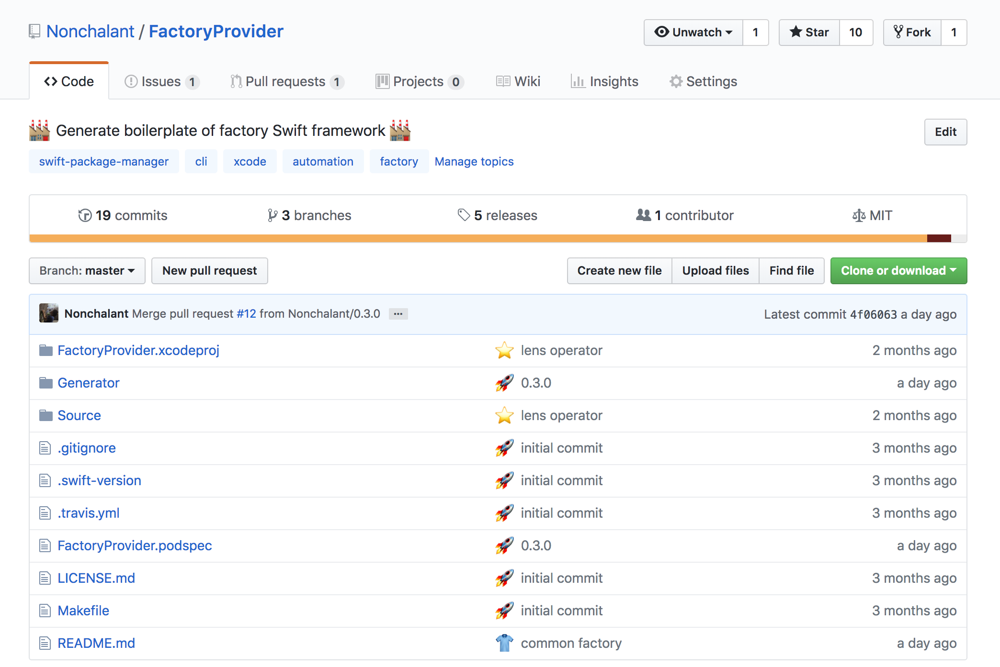
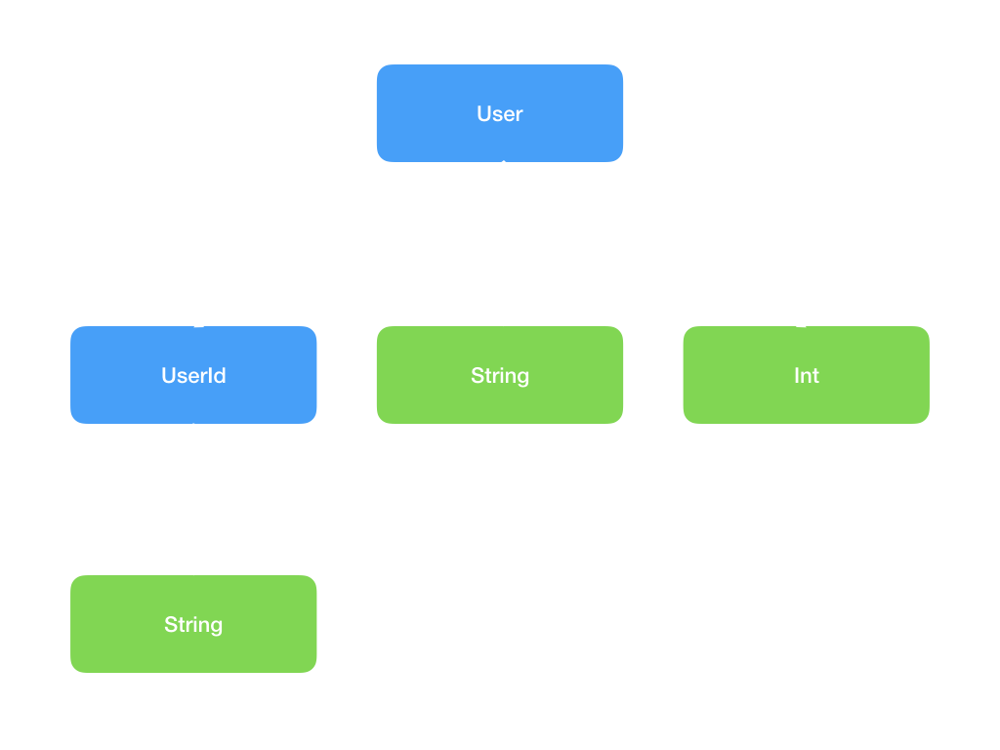

footer: Factoryの自動生成によりテストを書きやすくする, iOSDC 2018 Reject Conference days1
slidenumbers: true

# Factoryの自動生成によりテストを書きやすくする

---

# Takeshi Ihara

- AbemaTV
- Twitter: @nonchalant0303
- GitHub: Nonchalant


---

### Test

```swift
struct User {
    let age: Int
    
    var isAdult: Bool {
        return age >= 20
    }
}

class UserTests: XCTestCase {
    func test20歳以上なら成人である() {
        let user = User(age: 20)
        XCTAssertTrue(user.isAdult)
    }
    
    func test20歳未満なら成人でない() {
        let user = User(age: 19)
        XCTAssertFalse(user.isAdult)
    }
}
```

---

### New Property

[.code-highlight: 2]

```swift
struct User {
    let name: String
    let age: Int
    
    var isAdult: Bool {
        return age >= 20
    }
}

class UserTests: XCTestCase {
    func test20歳以上なら成人である() {
        let user = User(age: 20)
        XCTAssertTrue(user.isAdult)
    }
    
    func test20歳未満なら成人でない() {
        let user = User(age: 19)
        XCTAssertFalse(user.isAdult)
    }
}
```

---

### Compile Error

[.code-highlight: 13, 18]

```swift
struct User {
    let name: String
    let age: Int
    let birthday: Date
    
    var isAdult: Bool {
        return age >= 20
    }
}

class UserTests: XCTestCase {
    func test20歳以上なら成人である() {
        let user = User(age: 20) // Missing argument for parameter 'name' in call
        XCTAssertTrue(user.isAdult)
    }
    
    func test20歳未満なら成人でない() {
        let user = User(age: 19) // Missing argument for parameter 'name' in call
        XCTAssertFalse(user.isAdult)
    }
}
```

---

### Fix Compile Error

[.code-highlight: 12, 17]

```swift
struct User {
    let name: String
    let age: Int
    
    var isAdult: Bool {
        return age >= 20
    }
}

class UserTests: XCTestCase {
    func test20歳以上なら成人である() {
        let user = User(name: "Takeshi Ihara", age: 20)
        XCTAssertTrue(user.isAdult)
    }
    
    func test20歳未満なら成人でない() {
        let user = User(name: "Takeshi Ihara", age: 19)
        XCTAssertFalse(user.isAdult)
    }
}
```

---

### Factory Pattern

オブジェクトの生成処理を共通化する

[.code-highlight: 1-5, 9, 14]

```swift
struct UserFactory {
    static func provide(name: String = "", age: Int = 0) -> User {
        return User(name: name, age: age)
    }
}

class UserTests: XCTestCase {
    func test20歳以上なら成人である() {
        let user = UserFactory.provide(age: 20)
        XCTAssertTrue(user.isAdult)
    }
    
    func test20歳未満なら成人でない() {
        let user = UserFactory.provide(age: 19)
        XCTAssertFalse(user.isAdult)
    }
}
```

---

### Cost of preparing Factory

- テストを書く際はロジックのみに集中したい
- 生成対象のオブジェクトの数だけFactoryが必要になる
- Factoryなどを用意するコストが高いとテストを書かかなくなる

---

## FactoryProvider

<sup>https://github.com/Nonchalant/FactoryProvider</sup>



---

## FactoryProvider

<sup>https://github.com/Nonchalant/FactoryProvider</sup>

- Factoryを自動生成するライブラリ
- Enum, Structが生成対象
- Lensをサポート
- ymlで設定項目を定義
- Generatorを含めるためにCocoapodsでのみインストール可能

---

### Factory (Struct)

型パラメータにStructを指定する

```swift
let user = Factory<User>.provide()
// User(name: "", age: 0)
```

---

### Factory (Enum)

型パラメータにEnumを指定する

```swift
let season = Factory<Season>.provide()
// Season.spring

enum Season {
    case spring
    case summer
    case automn
    case winter
}
```

---

### Generated Object

基本的に固定値で生成される😱

[.code-highlight: 1-2, 5]

```swift
var user = Factory<User>.provide()
user.name = "Takeshi Ihara" // Cannot assign to property: 'name' is a 'let' constant

struct User {
    let name: String
    let age: Int
    
    var isAdult: Bool {
        return age >= 20
    }
}
```

---

### Lens

- 不変性を保ちつつネストしたデータ構造に対するアクセスをLensの合成で表現できるようにしたもの
- 元々はHaskell, Scalaの概念
- SwiftzのLens実装を独立したフレームワークとして切り出したFocusというフレームワークも存在

---

### Lens

```swift
import FactoryProvider

let user = Factory<User>.provide()
// User(name: "", age: 0)

let newUser = user |> User._name *~ 20 // User._nameをLensと呼ぶ
// User(name: "", age: 20)
```

---

### Lens (Nested)

[.code-highlight: 4, 9-11, 13-14]

```swift
import FactoryProvider

struct User {
    let id: UserId
    let name: String
    let age: Int
}

struct UserId {
    let value: String
}

let user = Factory<User>.provide() |> User._id * UserId._value *~ "nonchalant0303"
// User(id: UserId(value: "nonchalant0303"), name: "", age: 0)
```

---

### Config

ymlファイルで設定する

```yml
includes: # 生成対象のStruct, Enumを含んだファイルへのパス (ファイル単位、ディレクトリ単位)
  - Input/SubInput1
  - Input/SubInput2/Source.swift
excludes: # 生成対象のStruct, Enumの例外を含んだファイルへのパス
  - Input/SubInput1/SubSubInput
  - Input/SubInput2/Source.swift
testables: # テスト対象のターゲット
  - target1
  - target2
output: output/Factories.generated.swift # 自動生成されたコードのパス
```

---

### Build Phases

テストの実行時にFactoryの自動生成スクリプトを呼び出す

```bash
"${PODS_ROOT}/FactoryProvider/generate" --config .factory.yml
# Factories.generated.swift is generated 🎉
```

---

## How FactoryProvider Works

2つのコードベースから成り立つ

- ライブラリのコード (Fixed)
- 自動生成されるコード (Generated in Build Phases)

---

### Providable (Library Code)

Providableに準拠した型がFactoryでオブジェクトを取得できる

```swift
public protocol Providable {
    static func provide() -> Self
}
```

---

### Primitive Factory (Library Code)

Primitiveな型のFactoryが定義されている (Int, Optional, String, ...)

```swift
extension Int: Providable {
    public static func provide() -> Int {
        return 0
    }
}

extension Optional: Providable where Wrapped: Providable {
    public static func provide() -> Optional {
        return .some(Wrapped.provide())
    }
}

...
```

---

### Factory (Generated Code)

```swift
struct Factory<T> {
    static func provide() -> T {
        switch T.self {
        case is Providable.Type:
            return (T.self as! Providable.Type).provide() as! T
        default:
            fatalError()
        }
    }
}
```

---

### Specified Factory (Generated Code)

```swift
extension User: Providable {
    static func provide() -> User {
        return User(
            id: Factory<UserId>.provide(),
            name: Factory<String>.provide(),
            age: Factory<Int>.provide()
        )
    }
}

extension UserId: Providable {
    static func provide() -> UserId {
        return UserId(
            value: Factory<String>.provide()
        )
    }
}
```

---

### Specified Factory (Generated Code)

葉がすべてPrimitiveな型になるまで木を伸ばす



---

### Lens (Library Code)

```swift
public struct Lens<A, B> {
    private let getter: (A) -> B
    private let setter: (B, A) -> A

    public init(getter: @escaping (A) -> B, setter: @escaping (B, A) -> A) {
        self.getter = getter
        self.setter = setter
    }

    public func get(_ from: A) -> B {
        return getter(from)
    }

    public func set(_ from: B, _ to: A) -> A {
        return setter(from, to)
    }
}
```

---

### Custom Operator (Library Code)

```swift
infix operator *~: MultiplicationPrecedence
infix operator |>: AdditionPrecedence

public func * <A, B, C> (lhs: Lens<A, B>, rhs: Lens<B, C>) -> Lens<A, C> {
    return Lens<A, C>(
        getter: { a in
            rhs.get(lhs.get(a))
        },
        setter: { (c, a) in
            lhs.set(rhs.set(c, lhs.get(a)), a)
        }
    )
}

public func *~ <A, B> (lhs: Lens<A, B>, rhs: B) -> (A) -> A {
    return { a in
        lhs.set(rhs, a)
    }
}

public func |> <A, B> (x: A, f: (A) -> B) -> B {
    return f(x)
}

public func |> <A, B, C> (f: @escaping (A) -> B, g: @escaping (B) -> C) -> (A) -> C {
    return { g(f($0)) }
}
```

---

### Lens (Generated Code)

```swift
extension User {
    static var _name: Lens<User, String> {
        return Lens<User, String>(
            getter: { $0.name },
            setter: { name, base in
                User(name: name, age: base.age)
            }
        )
    }
    static var _age: Lens<User, Int> {
        return Lens<User, Int>(
            getter: { $0.age },
            setter: { age, base in
                User(name: base.name, age: age)
            }
        )
    }
}
```

---

### Decompose

```swift
let user = Factory<User>.provide() |> User._name *~ "Takeshi Ihara"
         = (User._name *~ "Takeshi Ihara")(Factory<User>.provide())
         = { user in
               Lens<User, String>(
                   getter: { $0.name },
                   setter: { name, base in
                       User(name: name, age: base.age)
                   }
               ).set("Takeshi Ihara", user)
           }(Factory<User>.provide())
         = Lens<User, String>(
               getter: { $0.name },
               setter: { name, base in
                   User(name: name, age: base.age)
               }
           ).set("Takeshi Ihara", Factory<User>.provide())
         = User(name: "Takeshi Ihara", age: 0)
```

---

## Result

[.code-highlight: 10, 14, 19]

```swift
struct User {
    let name: String
    let age: Int
    
    var isAdult: Bool {
        return age >= 20
    }
}

import FactoryProvider

class UserTests: XCTestCase {
    func test20歳以上なら成人である() {
        let user = Factory<User>.provide() |> User._age *~ 20
        XCTAssertTrue(user.isAdult)
    }
    
    func test20歳未満なら成人でない() {
        let user = Factory<User>.provide() |> User._age *~ 19
        XCTAssertFalse(user.isAdult)
    }
}
```

---

## Conclusion

- Factoryを用意する手間がなくなったのでテストに集中できる😍
- テスト対象のプロパティが分かりやすくなった✨
    - `Factory<User>.provide() |> User._age *~ 19`
- `SourceKitten`を使ってパースして自動生成するの楽しい🚀


